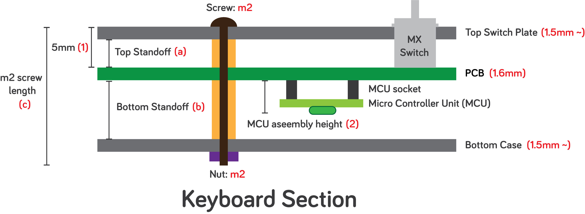

# General guide for selecting/sourcing parts

This is a supporting repository for the keyboards that I made. All the keyboards here are a hobby project, and are not commercially available. 

## How to find and where to buy hardware?

When I sell some extra pieces, I usually do not include hardware because it's selection varies on your setup, e.g., soldered build, hot-swap build, ProMicro build and so on. Here I will write how to select parts to suit your build in my preferred way. However, do note that there is no right way to doing it. There are various ways to assemble a keyboard, so please take this as a reference. 

Most of the keyboards and cases that I make have the structure like this:

As you can see here, you usually only need to decide the length of the standoffs (a), (b), and the length of a m2 screw (c). 

### Invariable factors

- Most single layered PCBs are 1.6mm in thickness. 
- Most stainless steel plates are 1.5mm in thickness.
- The distance between the top of PCB and the top of the switch plate **(1)** is 5mm when using MX switches. If you use 0305 Mil-Max hot-swap sockets, they will push the switches up about **0.5mm**, so the distance **(1)** will be about **5.5mm.**
- MCU assembly height **(2)** depends on your selection of parts. If want to go very cheap, you can use ProMicro and cheap machine pin sockets, and it will make the distance **(2)** **8mm**. If you want to go fancy, you can use ultra-low profile sockets and Elite-C, which will then make the distance **(2) 6mm.**

### Choosing a top standoff (a)

Based on the invariable  factor above,

-  If solder your switches and use a FR4 switch plate, you need a m2 standoff that fills 5mm - 1.6 mm = 3.4mm. Because a 3.4mm standoff does not exist, you can just use **3mm m2 standoff** and **0.5mm m2 washer**. 
- If you go for a hot-swap build with a 7304 Mil-Max socket, you you need a m2 standoff that fills 5.5mm - 1.6 mm = 3.9mm, and you can just use **4mm m2 standoff** . 

### Choosing a top standoff (b)

Based on the invariable  factor above,

- If you go with the cheap option, the minimum height of the bottom standoff (b) is **8mm.** 
- If you go with the fancy option, the minimum height of the bottom standoff (b) is **6mm.** 
- Choosing the minimum height may let your MCU touch the bottom case. 

### Choosing a screw (c)

Now you just need to add them up. To tighten things up with m2 nuts, you need about 2mm of a margin at the tip of s screw. So the length of the screw of your choice will be:

**Minimum screw length** = top switch plate thickness + top standoff height + PCB height (~1.6mm) + bottom standoff height + bottom case thickness + 2mm margin.

### Middleware height

If you want to add a middleware to prevent flexing in a FR4 case setup, the height of the middleware will be just the sum of the top and bottom standoff heights and the PCB thickness (1.6mm).

### Examples

- If you want to go with a cheapest setup with a FR4 plate case, Promicro, and soldered build: 
  - You can use 3mm standoffs and 0.5mm washers for the upper chamber.
  - You can use 8mm standoff for the lowerchamber.
  - You can use 3 + 1.6 + 8= 13.6 mm middleware. To make things simple, you can add 0.5mm washers to the bottom standoffs, and just make 14mm middleware.
  - The total thick of the case will be 1.6mm + 14mm (middleware) + 1.6mm = 17.2mm. So, You can use 20mm m2 screws.
- If you want to go with a fancy setup with a 0305 MilMax socket, SS plate, custom 3D printed case, Elite-C and ultra low profile sockets, and if we assume that the bottom plate of the 3D printed case is 3mm:
  - You can use 4mm standoffs for the upper chamber.
  - You can use 6mm standoffs for the upper chamber.
  - You can use   = 11.6 mm middleware. To make things simple, you can add 0.5mm washers to the bottom standoffs, and just make 12mm middleware.
  - The total thick of the case will be 1.5 mm (SS plate) + 12mm (middleware) + 3mm (3d printed case) = 16.5mm. So, you can use screws longer than 18.5 mm. 18mm will be also ok. 

## Where to buy?

Below is the places that I check for parts. 

Complied list

https://docs.google.com/spreadsheets/d/1yFxFad6Fp7bDsbbrUbymgozWEZLEjbd6_0tXTSnRA-c/edit?usp=sharing

- For cheap items like screws and standoff:
  - Amazon: expensive, but takes a few days to be delivered. 
  - Walmart: somewhat expensive, and takes about two weeks to be delivered.
  - Aliexpress: dirt cheap, but takes forever to be delivered. 

If you are ok with a slow progression, I recommend to buy a bunch from Aliexpress. 

- For fancier items like ultra low profile sockets:
  - Digikey
  - Mouser

Do not buy cheap items like standoffs or screws from Digikey or Mouser. They are pretty expensive. I usually buy a lot of 18mm, 20mm screws and 4mm, 6mm, 8mm standoffs, and 0.5mm fiber washers.

### Note

- You can be flexible in sourcing parts. For example, If you need 8mm standoffs but could only find 7mm standoffs available, you can just buy 7mm ones and add two 0.5mm fiber washers. 

##  Where to make a custom case and plate?

- https://sendcutsend.com/
- https://www.treatstock.com/
