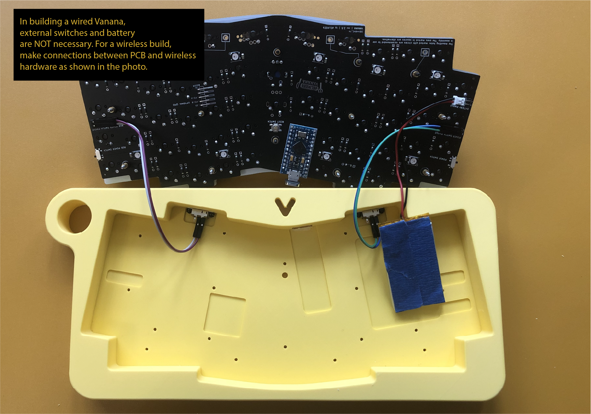

#  

# Vanana (rev 2.5 GB) Build Guide

Last Update: 210620

We will go through the process of fully assembling Vanana.

## Required Hardware:

**Overview** 

**Hardware used to make this build:** 

- Vanana Thicc Case x 1 
- Vanana Plate x 1 
- m2 screws 7mm x 4
- m2 screws 18mm x 12
- m2 Standoff 5mm x 12 
- m2 Standoff 4mm x 12
- m2 Nuts x 12
- m2 Washer x 12 
- EC11 Rotary Encoder x 1 (optional)
- Dupont cable x 3 (optional for the encoder 2 or RGB) 
- Right angle headers x 9 (optional)
- Straight angle headers (This usually comes with your MCU. Make sure that the height of the insulation is less than or equal to 3mm)

**Optional hardware for a wireless build:** 

- Dupont cable x 6 (2 cables for RGB, Power switches, and battery) 
- Slide Switch x 2
- LiPo Battery **(will not be included in the GB kit)**

**Optional hardware for a Hot-swap functionality:** 

- Ultra-low profile Pin Socket (for a MCU board) 
- Round machine pin x 12 (for a MCU board) 
- Mil Max 0305 x 120 (for key switches) 

**And, of course:**

- MCU board of your choice (Pro Micro, Elite-C, Nice!nano)
- Switches and keycaps.

**Useful quality-of-life tools (links are only for reference):**

- Masking tape like [this one](https://www.amazon.com/AmazonBasics-Masking-Tape-Inch-Rolls/dp/B07QHSKGMH)
- M2 hex nut driver like [this one](https://www.amazon.com/uxcell-Non-Magnetic-Point-Driver-3-Inch/dp/B07DXZJQ4S/ref=sr_1_40?dchild=1&keywords=Hex+Nut+Driver+m2&qid=1619655993&s=hi&sr=1-40)
- M2 hex driver like [this one](https://www.amazon.com/gp/product/B001ATKWJY/ref=ppx_yo_dt_b_search_asin_title?ie=UTF8&psc=1) 
- or, the all-in-one driver set [this one](https://www.amazon.com/iFixit-IF145-299-4-Driver-Bit-64pc/dp/B0189YWOIO/ref=sr_1_5?dchild=1&keywords=driver+kit&qid=1620838333&sr=8-5)

## Assembly Order

1. Soldering on PCB: MCU Board sockets and right-angle headers
2. Switchplate Assembly
3. (if your build is soldered) Keyboard Switches
4. (if your build is hot-swappable) Hot-swap sockets
5. Assembling MCU board onto the PCB
6. (if your build is wireless) Battery and external Switches

## Assembly instruction

### Step 1. Soldering on PCB: MCU Board sockets and right-angle headers

On the Group buy version, all the essential parts are pre-soldered, which includes:

- Diodes
- Capacitors
- 2x onboard slide switches
- Reset switch
- RGB Underglow LEDs

You only need to solder a few parts on PCB and assemble an MCU board on it. 

**Parts you need:**

- Ultra-low MCU board sockets **or** straight pin headers. 
- (wireless setup only) 3 x 2-pos Right angle headers.
- (Optional for RGB underglow and the encoder 2) 1 x 3-pos (or 5) Right angle header.

**Steps**:

1. Insert ultra-low profile sockets (for a hot-swap build) **or** straight pin headers (for a soldered build) from the back of the PCB. The photo below shows compatible sockets and headers. You will use **one of them** depending on your build. Make sure the height of the insulations of the header or sockets (black plastic part in the photo below) are less than or equal to 3mm. Most straight pin headers that come with MCU boards have insulations whose height is less than 3mm. Masking tape will help you secure the parts when soldering them. Solder MCU sockets or headers from the front of the PCB.
   
2. Note that there are two onboard switches on both sides of the PCB. One is for RGB, and the other is for the Power switch. (Down: OFF/ Up: ON). If you are building a **wired Vanana, just toggle up the switches and skip to the next section (Step 2. Switch Plate Assembly). If you are building a wireless Vanana with a plate case kit**, you can also skip to the next section.
   
3. If you are building a **wireless Vanana with 3D printed cases**, it is time to solder 3 x 2-pos right-angle pin headers to use external switches and batteries. 
   - At the time of designing the board, the RGB switch was added to cut off the quiescent current draw of RGB LEDs. Now the software RGB control of ZMK is equivalent to the hardware switch, so you can skip soldering the RGB switch header pin if you do not mind using a software switch to control RGB underglow.

- - Note that there are two types of right-angle headers included. Use the one with an insulation perpendicular to the PCB for this step. The other one will be used to mod an MCU board.
    
  - Prepare the headers as shown in the photo. Place the right-angle pin headers on the back of the PCB. You may want to use tape to secure the header. Solder the pin headers from the front of the PCB. Place the header pins flat on the PCB. 
    
  - Solder the right angle headers onto the PCB as shown in the photo. Masking tape will help you secure the parts. There are three places to install the 2-pos headers. Place the headers on the back of the PCB, and solder them from the front. 
    

4. If you want to enable RGB underglow or the encoder at position 2, solder the header on the PCB as below. The procedure is the same as the step above. 

5. If you are going to use rotary encoders, solder it on the PCB.

- -  A rotary encoder at position 1 is supported by all Pro Micro compatibles and Nice!nano by default. However, only Nice!nano and Elite-C supports a rotary encoder at position 2 because it uses extra GPIO pins on Elite-C and Nano, which will be covered in the later section. Likewise, RGB underglow is supported only with Elite-C and Nice!Nano.

- 

- 

### Step 2. Switch Plate Assembly

**Parts you need:**

- 12 x m2 screws 
- 12 x Short m2 standoffs

**Steps**:

1. You are free to change the positions of screws at your preference. The ones marked red in the photo above are the recommended locations.
2. Insert screws into the switch plate from the top.
3. Insert **short M2 standoffs/spacers** (4mm one in GB version kits) and tighten them. You can do this by hand. However, if you want a rock-solid build, use a small plier to hold the standoffs/spacers and an m2 hex screwdriver to tighten them). 
4. Assemble the PCB and the switch plate. Place **the long standoffs** and tighten them.  
   
   

### Step 3. (if your build is soldered) Keyboard Switches

**Parts you need:**

- 60 x keyboard switches

1. Vanana GB version supports three layouts. Choose your layout and insert switches into the appropriate positions.
   
2. Plate switches on the plate. Make sure that all the switches are fully inserted into the holes on the plate. 
   
3. Solder the key switches from the back of the PCB. 
   
   

### Step 4. (if your build is hot-swappable) Hot-swap sockets

**Parts you need:**

- 120 x 0305(or 7305) Mill-Max hotswap sockets 

**Steps:**

1. If your build is hot-swappable, you will use 0305 or 7305 hot-swap sockets. Place hot-swap sockets into the switch holes on the PCB. A precision tweezer will be your timesaver. 

- - My favorite way of installing 0305 sockets is to solder them on one or two columns at a time. Plate them on the PCB and secure them with masking tape. Then, solder sockets from the back of the PCB. Repeat until you get all the sockets soldered.
  - If this is the first time, I highly recommend practicing with at least a few sockets on a scrap board. It is not hard, but you need to progress slowly with patience. Check video [tutorials](https://www.youtube.com/watch?v=wmkTVsZ97Vk).
  - Do not put an excessive amount of soldering iron. Use the amount of solder iron that is just enough to fill the gaps between the socket and the hole. Less is better than more in doing this. 

- 

- 

### Step 4. MCU board Assembly (and mod).

**Parts you need:**

- MCU board: Pro Micro compatibles or Nice!nano
- Triplet of **Short** Dupont cable

**Steps:**

1. (**optional**) If you use Elite-C or Nice!nano, and want to enable RGB underglow or the rotary encoder at position 2, the following mod will be useful. We use Dupont cable for easier maintenance

- - My preferred way of doing this is to place a right-angle header, cut the excessive header pins, secure the header pins with masking tape, and solder them on the board. 

2. If you used regular straight pin headers, place the MCU board on it and solder them. If you used ultra-low profile hot-swap sockets, place the MCU board on it, insert compatible machine pins, and solder them.

3. (**optional**) Connect the extra GPIO pins of the MCU board to PCB using the **short** Dupont cables included, if you want to enable RGB underglow or to use the encoder at position 2. 

   

### Step5. (Wireless build only) External switch and battery assembly

If you are building a wired Vanana, you can skip this section. 

**Parts you need:**

- 3 x pair of **long** Dupont cable
- 4 x **short** m2 screws
- 4 x m2 nuts

**Steps:**

1. Prepare slide switches as shown below using **long** Dupont cables. 
   

2. Place the external switches and assemble them with short m2 screws and nuts. 

   - My preferred way to do this step is to hold the nuts with a precision tweezer and tighten the screws using an m2 hex screwdriver from the other side. Connect the switches to the PCB using the long Dupont cables.
   - Note that the on/off directions of the switches depend on the cable arrangement in this step.

   

3. Prepare the battery of your choice. 

   - The Vanana cases have a recessed area to place a battery. The maximum size of a battery for the GB version is 45mm(W) x 55mm(D) x 5mm(H). For a hot-swap build, batteries thinner than 4mm are recommended. If your battery has a JST cable installed, you can just connect them to the pin headers. If not, you can solder the long Dupont cables to the batteries and do the same. 

4. Connect the battery to the PCB using the long Dupont cable. 

- - **IMPORTANT**!!: The battery pinout on the board has polarity. **MAKE SURE TO CONNECT THE WIRES OF A BATTERY TO THE RIGHT SPOT**. In most cases, the red wire of a battery is +, and the black is -. However, double-check the polarity of your battery.
  - To secure the battery onto the case, you may want to use a thin double-sided tape. Also, if you are using 0305 hot-swap sockets, the tip of the sockets may touch your battery when you close the case. Consider applying a thin non-conductive electrical tape to prevent the sockets to poke into the battery.

- 

### Step 6. Closing the case.

**Parts you need:**

- 12 x m2 nuts
- 12 x m2 washers

**Steps:**

1. We are almost there. Arrange the PCB assembly and the case as shown in the photo below. If you are building a wired Vanana, you do not need any cables connected. Just toggle on the onboard RGB switch. 
   

2. Close the PCB assembly on the case.
    

3. Assemble the PCB assembly and the case using m2 nuts and washers.

   - Washers are optional. However, it will help reduce the possible damage to the case, which could be caused by over-tightening nuts or prolonged time of use. 

   

4. Install the nuts included. Do not overtight the nuts. The nut we are using has a nylon insert, so it will lock in position without overtightening. 
    

5. Place rubber pad on the feet. 
   

### Step 7. Enjoy Vanana

You are all set! Install your favorite keycaps, and enjoy your delicious Vanana!

