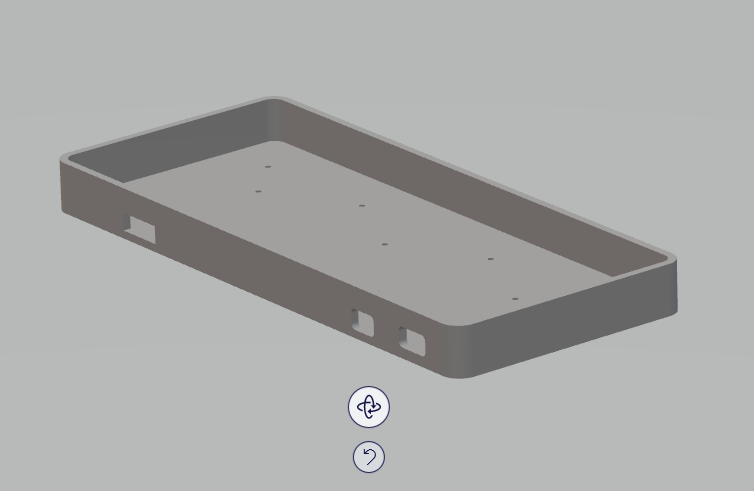

# Flatbread60 Support Page

## Pinout

MATRIX_ROW_PINS { F6, B1, B3, B2, B6 }

MATRIX_COL_PINS { F4, F5, B5, B4, E6, D7, C6, D4, D0, D1, D2, D3 }

## Firmware

I will push the firmware to the official QMK repo, so that you can use QMK configurator. Until then, you can compile the firmware using the raw file in the designated directory with a conventional QMK dev setup. Or, you can use the complied .hex file with QMK toolbox. The comilpled file has a `almost default` Preonic 48 key layout. Please check `keymap.c` file. 

## Housing Materials

- STL file for 3D printed case is uploaded.
- Wired case only has a hole for USB connector,  and wireless versions has two holes for power switches. 
- Hight of the case is 20mm
- Plate dxf file is also uploaded. 

