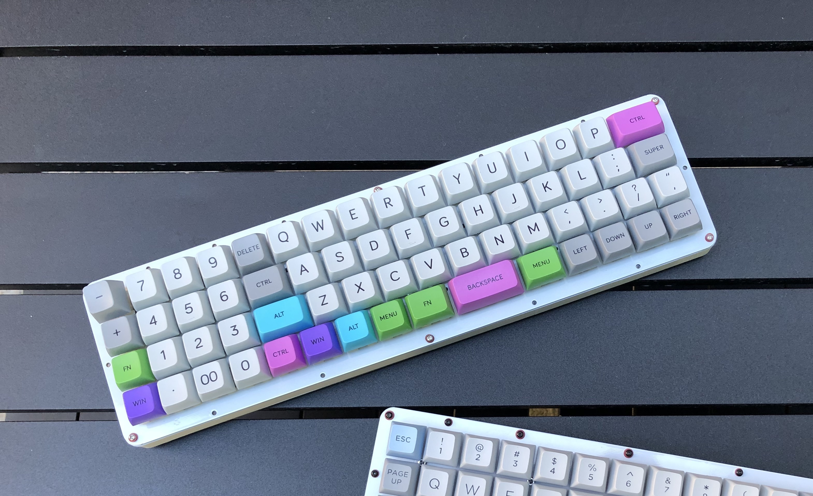
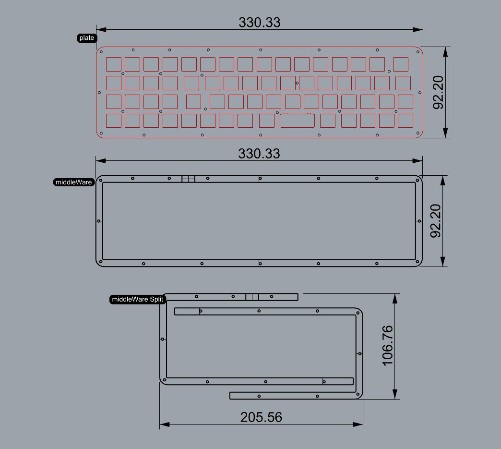

# Vaneela Ex Support Page

## Pinout

MATRIX_ROW_PINS { D3, D2, D1, D0, B2, B6 }

MATRIX_COL_PINS { F4, F5, F6, F7, B1, B3, B5, B4, E6, D7, C6, D4 }

## Firmware

I will push the firmware to the official QMK repo, so that you can use QMK configurator. Until then, you can compile the firmware using the raw file in the designated directory with a conventional QMK dev setup. Or, you can use the complied .hex file with QMK toolbox. The comilpled file has a numpad + almost default planck 48 key layout. Please check `keymap.c` file. 

## Housing Materials

- `plate.dxf` file is for a  laser-cut switch plate.
- The middleware is 16mm in height. However, the height actually depends on your setup, so you many need to adjust the height.
- The split middleware file is for a 3D printer that has small printing bed.
- I personally prefers super-tight-ultra-solid assemblies, so my plate and 3D pieces have a lot of mounting holes. You do not need to use all the holes, I guess.. 

